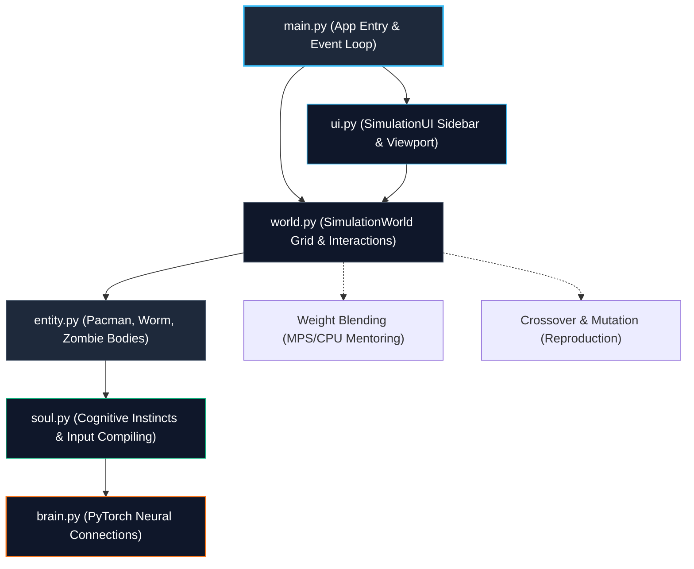

[README.md](https://github.com/user-attachments/files/28375029/README.md)
# A-Life Pac-Man: Evolutionary Neural Network Simulation

[](https://www.python.org/)
[](https://pytorch.org/)
[](https://www.pygame.org/)
[](https://opensource.org/licenses/MIT)

An artificial life (A-Life) simulation that merges classical arcade mechanics with evolutionary neural networks. In this environment, two competing colonies (**spots** and **stripes**) evolve independent behavioral strategies to forage, raid opposing castles, defend gates, protect friendly infants, and cultivate gardens. 

Rather than utilizing static state machines, each agent's movement and actions are driven by an independent PyTorch feedforward neural network that undergoes selection pressure, mutation, and genetic crossover over successive generations.

---

## 🛠 Architecture Topology

The software topology is strictly decoupled. Physical body variables are separated from cognitive path controllers (minds/souls) and vector render engines:



### Decoupled Subsystem Breakdown:
* **[brain.py](file:///Users/rahulvijayaragavan/Documents/Google_agi/pacman/brain.py)**: A PyTorch feedforward neural network ($7 \text{ inputs} \to 12 \text{ hidden} \to 6 \text{ outputs}$) mapping inputs to drives. Handles device mappings (CPU/MPS acceleration), Gaussian mutations, and uniform weight crossovers.
* **[soul.py](file:///Users/rahulvijayaragavan/Documents/Google_agi/pacman/soul.py)**: The decision-making layer. Compiles 7 sensory inputs (e.g., proximity to food, mates, base, enemies) and processes overrides (e.g., low-population panic breeding, female rescue drives).
* **[entity.py](file:///Users/rahulvijayaragavan/Documents/Google_agi/pacman/entity.py)**: Manages physical states (positions, sub-tile gliding velocity, age progression, energy consumption) for Pac-man, Worms (prey), and Night Zombies (predators).
* **[world.py](file:///Users/rahulvijayaragavan/Documents/Google_agi/pacman/world.py)**: Orchestrates the physical board grid, BFS navigation paths, day/night cycles, and interaction resolvers (combat, weight blending, breeding, agricultural eras).
* **[ui.py](file:///Users/rahulvijayaragavan/Documents/Google_agi/pacman/ui.py)**: Formats vector shapes, renders live diagnostic overlays (neural synapse networks, population history curves, and the purple event logger console).
* **[main.py](file:///Users/rahulvijayaragavan/Documents/Google_agi/pacman/main.py)**: The entry point managing pygame displays and physics tick multipliers.

---

## 🧬 Key Evolutionary Mechanics

1. **Asexual Social Mentoring (Weight Blending)**:
   When an adult and an infant of the same species are adjacent, weight blending is triggered. The infant's brain parameters are updated via linear blending interpolation:
   $$\mathbf{W}_{\text{infant}} = \mathbf{W}_{\text{infant}} \times 0.85 + \mathbf{W}_{\text{adult}} \times 0.15$$
2. **Dynamic Selection & Reproduction**:
   Adults with high fitness scores (earned by gathering resources and defending bases) are selected to breed. Offspring brains are constructed through a uniform crossover mask:
   $$\mathbf{W}_{\text{child}} = \text{Crossover}(\mathbf{W}_{\text{mother}}, \mathbf{W}_{\text{father}}) + \text{Gaussian Noise}$$
3. **Senescence (Aging)**:
   Agents progress from **Infancy** (growth and base-feeding) to **Adulthood** (productivity and mating) to **Old Age** (40% speed drop, no mating/planting, acts as base defenders blockading gates).
4. **Agrarian Era Unlocks**:
   Accumulating 20 mushrooms in a base unlocks agriculture. Adults carrying food can seed nearby garden plots to grow cultivated crops, reducing wild foraging risks.

---

## ⌨️ Simulation Controls

Launch the simulation and interact with the environment in real time using the following keyboard bindings:

| Key | Action |
| --- | --- |
| **`[SPACE]`** | Play / Pause the simulation |
| **`[R]`** | Restart / Reset the simulation and logs |
| **`[M]`** | Manually spawn a wild magic mushroom |
| **`[P]`** | Toggle active BFS path guides overlay |
| **`[1]` - `[5]`**| Set simulation speed multiplier (`1x`, `2x`, `3x = 5x`, `4x = 10x`, `5x = 20x`) |
| **`[UP]`** | Increase Life Expectancy by 1 minute |
| **`[DOWN]`** | Decrease Life Expectancy by 1 minute |
| **`[CLICK]`** | Click on any Pac-Man on the maze grid to inspect its neural graphs and thoughts |
| **`[ESC]`** | Exit the simulation |

---

## 🚀 Installation & Running

### 1. Prerequisites
Ensure you have Python 3.9+ installed.

### 2. Set Up Virtual Environment & Dependencies
Clone the repository, initialize your virtual environment, and install dependencies:
```bash
# Initialize Virtual Environment
python3 -m venv .venv
source .venv/bin/activate

# Install Requirements
pip install -r pacman/requirements.txt
```

### 3. Run the Simulation
```bash
python pacman/main.py
```

### 4. Compiling Technical Documentation (PDF)
You can compile the technical publishing-ready architecture documentation using:
```bash
# Install PDF Compiler
pip install reportlab

# Generate PDF
python generate_pdf.py
```

---

## 📄 License
This project is licensed under the MIT License. See [LICENSE](LICENSE) for details.
